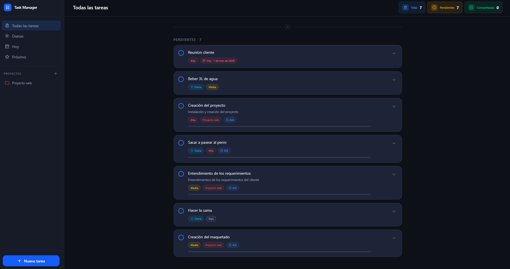
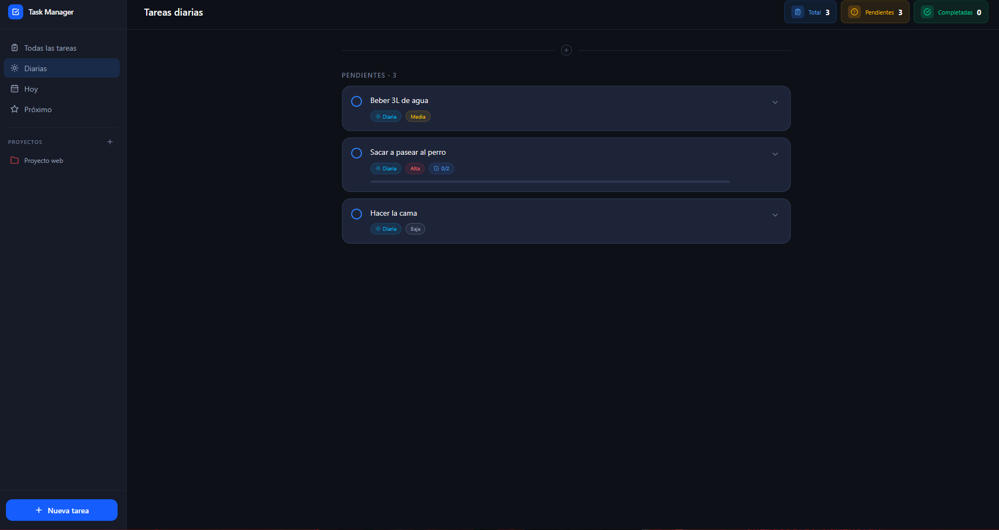
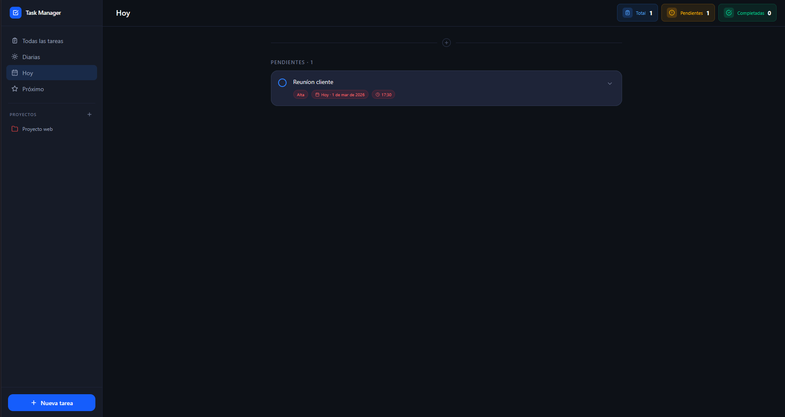
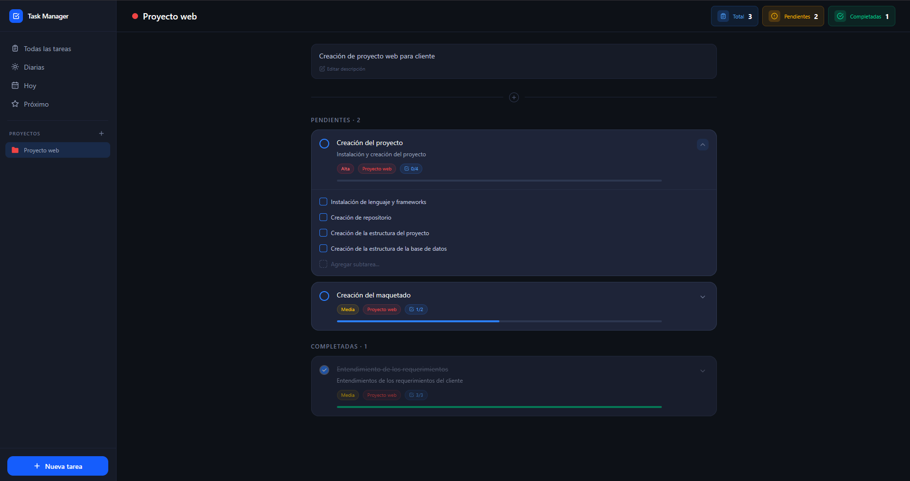

# Task Manager

Aplicación web full-stack para gestionar tareas personales con soporte de proyectos, subtareas, prioridades, fechas límite y reordenamiento por arrastre.

---

## Vista previa

| Todas las tareas | Tareas diarias |
|:---:|:---:|
|  |  |

| Tareas de hoy | Vista de proyecto |
|:---:|:---:|
|  |  |

---

## Stack tecnológico

| Capa | Tecnología | Versión |
|---|---|---|
| **Frontend** | Angular (Zoneless) | ^21.2 |
| | Angular CDK | ^21.2 |
| | Tailwind CSS | ^4.1 |
| | RxJS | ~7.8 |
| **Backend** | Hono + Node.js | ^4.12 |
| | Drizzle ORM | ^0.45 |
| | SQLite (libSQL) | — |
| | Zod | ^4.3 |
| **Tooling** | TypeScript | ^5.8 / ~5.9 |
| | pnpm | >= 9 |
| | Vitest | ^4.0 |

---

## Arquitectura general

```
┌─────────────────────┐        HTTP / JSON       ┌──────────────────────────┐
│   Angular 21        │  ──────────────────────▶  │   Hono (Node.js)         │
│   Zoneless + CDK    │  ◀──────────────────────  │   REST API :3000         │
│   :4200             │                           │                          │
└─────────────────────┘                           │   Drizzle ORM            │
                                                  │        │                 │
                                                  │        ▼                 │
                                                  │   SQLite (libSQL)        │
                                                  │   sqlite.db              │
                                                  └──────────────────────────┘
```

---

## Estructura del repositorio

```
task-manager/
├── frontend/   # Aplicación Angular → ver frontend/README.md
└── backend/    # API REST Hono     → ver backend/README.md
```

Cada subcarpeta tiene su propio README con documentación detallada:

- [frontend/README.md](frontend/README.md) — componentes, patrones, rutas y scripts del cliente
- [backend/README.md](backend/README.md) — endpoints, esquema de base de datos y scripts del servidor

---

## Requisitos previos

- **Node.js** >= 18
- **pnpm** >= 9

---

## Instalación y puesta en marcha

### 1. Clonar el repositorio

```bash
git clone https://github.com/<usuario>/task-manager.git
cd task-manager
```

### 2. Instalar dependencias

```bash
# Backend
cd backend && pnpm install

# Frontend (desde la raíz)
cd ../frontend && pnpm install
```

### 3. Inicializar la base de datos

```bash
cd backend
pnpm db:push
```

Esto crea el archivo `backend/sqlite.db` con todas las tablas.

### 4. Levantar los servicios

En dos terminales separadas:

```bash
# Terminal 1 — Backend
cd backend
pnpm dev        # http://localhost:3000

# Terminal 2 — Frontend
cd frontend
pnpm start      # http://localhost:4200
```

---

## Variables de entorno

Por defecto la aplicación no requiere variables de entorno. Si querés apuntar el frontend a un backend en una URL distinta, podés modificar la `baseUrl` en `frontend/src/app/services/task.service.ts`.

---

## Contribución

1. Crear una rama desde `main` con el formato `feat/<descripcion>` o `fix/<descripcion>`
2. Hacer commits atómicos con mensajes descriptivos en español o inglés
3. Asegurarse de que los tests pasen antes de abrir un PR: `pnpm test` desde `frontend/`
4. Abrir un Pull Request describiendo los cambios realizados

---

## Licencia

Este proyecto no tiene licencia definida. Uso personal.
